### Classification d'images sur les handwritten digits

Dans ce projet, nous avons créé un modèle de classification des chiffres manuscrits en utilisant des algorithmes d'apprentissage non supervis avec comme jeu de données les digits issus de sklearn.datasets.
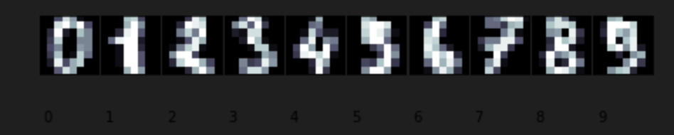
Pour celà nous procédons comme suit:
- Nous utilisons l'ACP (Analyse en Composantes Principales) pour réduire la dimension de nos images
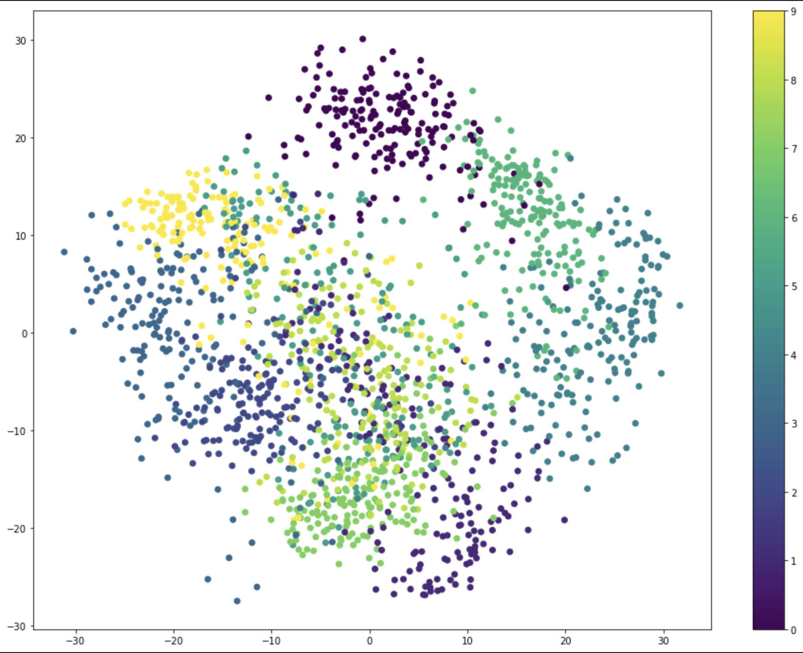
- Détermination du nombre de clusters avec la méthode du coude
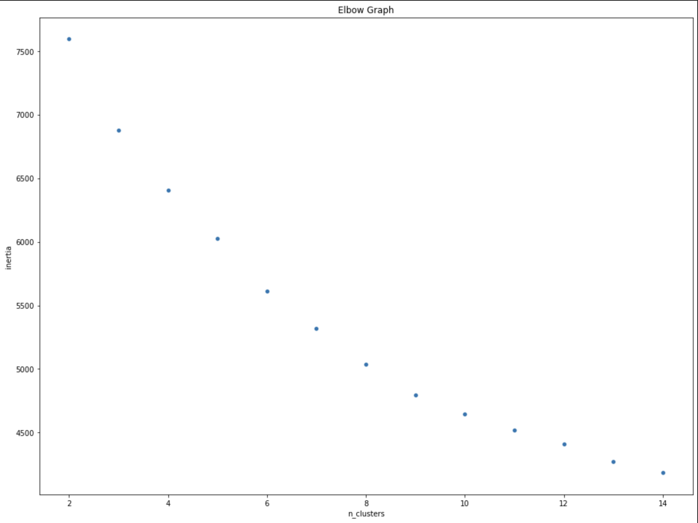
- Clustering avec Kmeans
<table>
<tr>
<th>Visualisation</th>
<th><Métriques/th>
</tr>
<tr>
<td>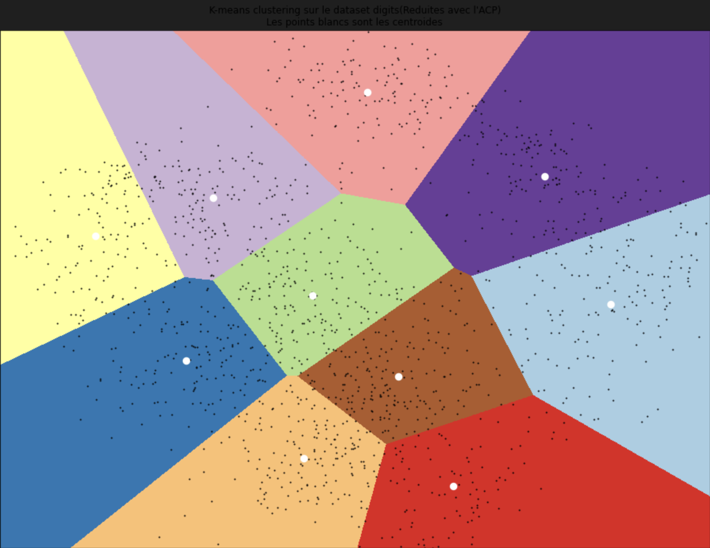</td>
<td>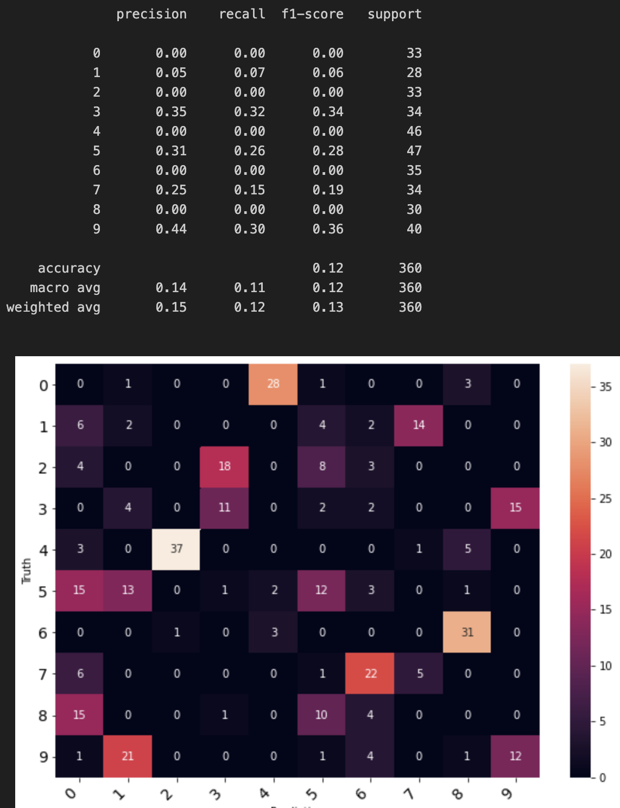</td>
</tr>
</table>
- Clustering avec Gaussian Mixture
<table>
<tr>
<th>Visualisation</th>
<th>Métriques</th>
</tr>
<tr>
<td>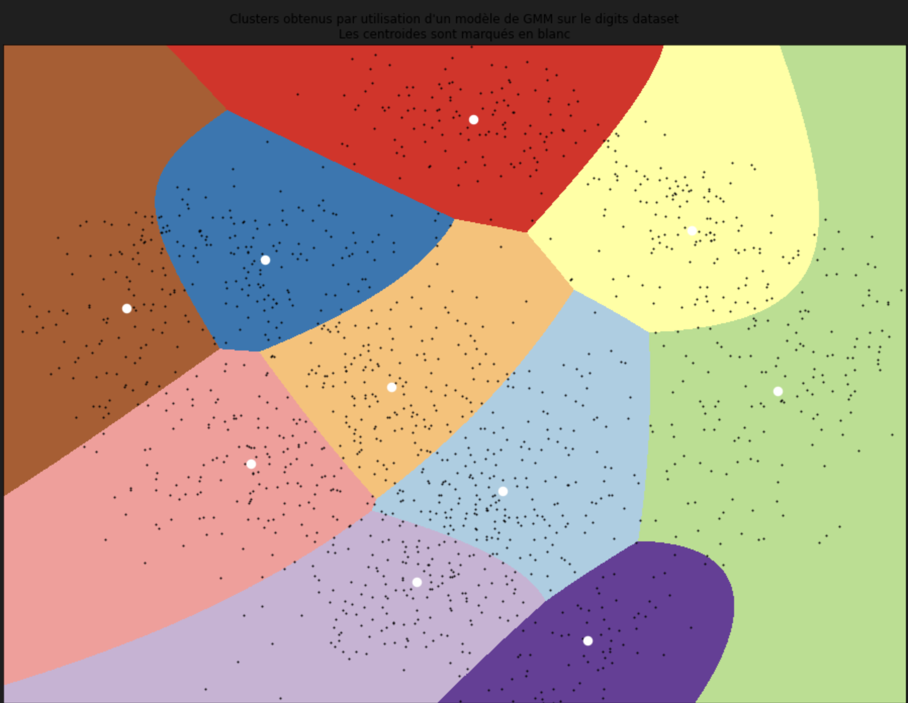</td>
<td>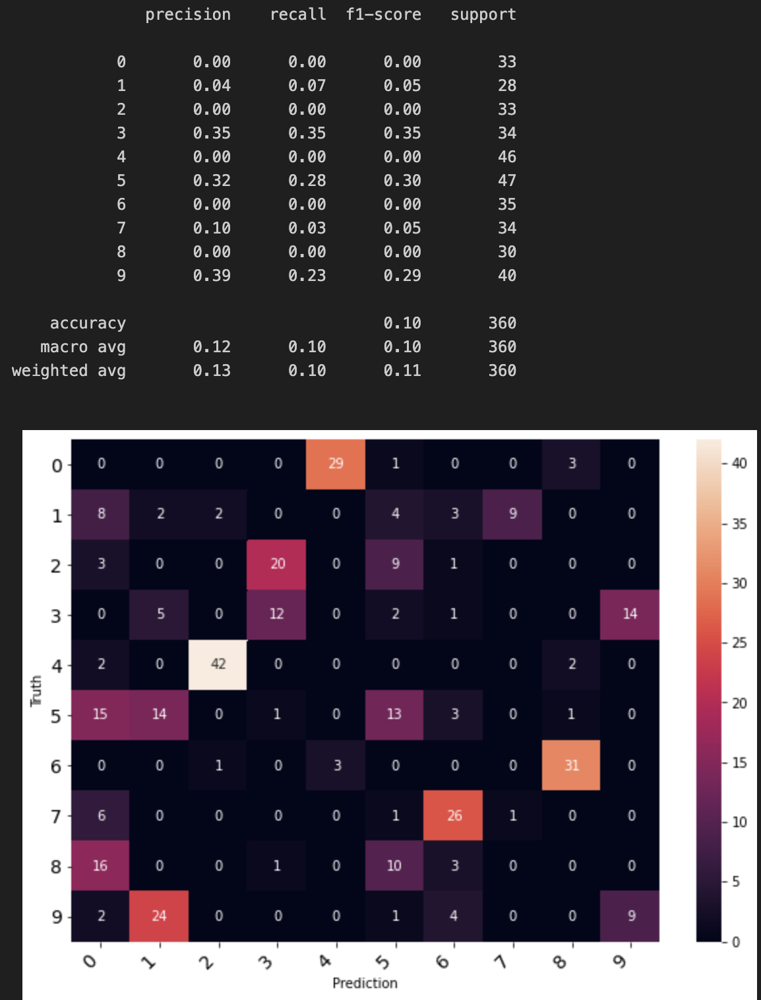</td>
</tr>
</table>

### Test sur interface graphique

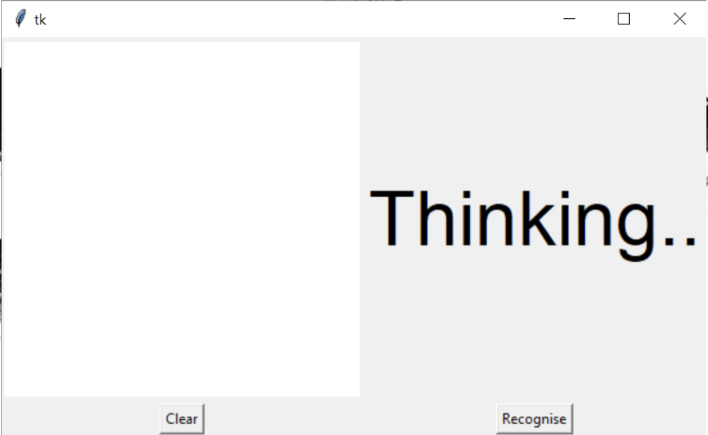
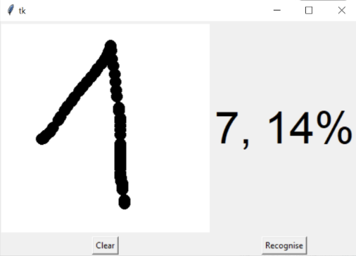
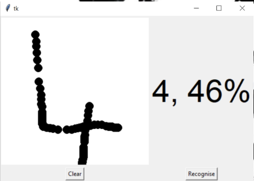
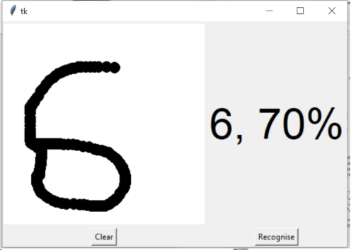
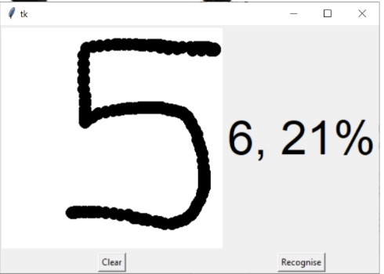

Le clustering, en plus d'être un apprentissage automatique non supervisé, peut également être utilisé pour créer des clusters en tant que fonctionnalités permettant d'améliorer les modèles de classification. À eux seuls, ils ne suffisent pas pour la classification, comme le montrent les résultats. Mais lorsqu'elles sont utilisées comme fonctionnalités, elles améliorent la précision du modèle.
Vous pourrez voir les résultats de cette utilisation au niveau du notebook *Classification_Sur_Handwritten_Digits.ipynb*.